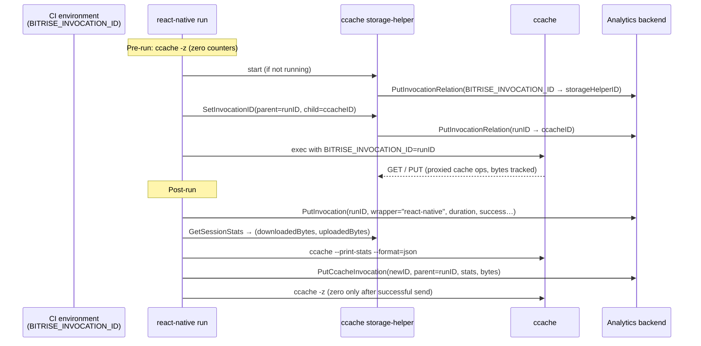

# Branch summary: `add-ccache-invocation-info` vs `main`

## Analytics reporting overview



The `ccache storage-helper collect-stats` command follows the same last three steps
and can be invoked manually or from any wrapper.

---

## 1. Protocol: `SetInvocationID` now carries both parent and child IDs

The `SetInvocationID` IPC message (opcode `0xB1`) previously sent a single invocation ID. It now carries an explicit parent→child pair, with the child UUID generated on the client side before the message is sent.

- **`internal/ccache/protocol/ccache_ipc.go`**: `WriteSetInvocationID(w, parentID, childID)` writes two length-prefixed strings; `ReadSetInvocationID(r)` returns `(parentID, childID, err)`
- **`internal/ccache/ipc_client.go`**: `SendInvocationID(ctx, socketPath, parentID, childID string)` — signature updated to pass both IDs; `SendStop(ctx, socketPath)` added to send a STOP request and block until the server ACKs
- **`cmd/reactnative/run_cmd.go`**: child UUID is generated in `BuildNotifyCcacheHelperFn` before calling `sendInvocationIDFn`, so both IDs are fully controlled by the caller

## 2. `onChildInvocation` callback in the IPC server

One callback decouples the server core from analytics:

- **`onChildInvocation func(prevInvocationID, parentID, childID string, downloadBytes, uploadBytes int64)`** — fired by `handleConnection` after each successful `SetInvocationID`. Receives the invocation ID that was *active before* the new child started (`prevInvocationID`), along with the parent→child IDs from the message and the bytes accumulated during the previous invocation.
- **`onShutdown`** is accepted by `NewServer` for callers that need it (e.g. tests), but the storage helper passes `nil` — stats are collected explicitly via `collect-stats`, not tied to server lifecycle.

`handleSetInvocationID` in `requestProcessor` only populates `processResult.InvocationParentID/ChildID`; callback dispatch and byte reset happen in `handleConnection` after `processRequest` returns, keeping the processor stateless with respect to callbacks.

## 3. Per-session byte tracking, atomic reset, and `GetSessionStats`

Bytes transferred (downloaded on GET, uploaded on PUT) accumulate in `sessionState`.

- **`internal/ccache/call_stats.go`**: `sessionState.resetAndGet()` atomically swaps both `downloadBytes` and `uploadBytes` to zero using `atomic.Int64.Swap(0)`. Both `resetAndGet()` and `activeInvocationID` reads are protected by the same `activeInvocationMu` so bytes and ID are always captured together without a race window.
- **`internal/ccache/protocol/ccache_ipc.go`**: new opcode `RequestGetSessionStats = 0xB2`; response is `OK` + two little-endian `int64` values (downloaded, uploaded). Does **not** reset the counters.
- **`internal/ccache/ipc_client.go`**: `SendGetSessionStats(ctx, socketPath) (int64, int64, error)` — queries the running helper for its current session byte counts.
- **`internal/ccache/ipc_server.go`**: `handleGetSessionStatsResult` reads counters under `activeInvocationMu` and writes the response; `SessionBytes()` exposes the current counters for tests.

## 4. Shared analytics packages

### `internal/analytics/multiplatform/`

Shared analytics client and payload types used by multiple command packages:

- **`client.go`**: HTTP client with bearer token auth, `Content-Type: application/json`, and retries. `Put(path, payload)` marshals to JSON and sends via HTTP PUT.
- **`invocations.go`**: `Invocation` — run-level payload (invocation ID, command, duration, success/error, CI and host metadata, `wrapper` field); `InvocationRelation`; `InvocationRunStats` (builder struct). `NewInvocation`, `PutInvocation`, `PutInvocationRelation`.

### `internal/ccache/analytics/`

ccache-specific analytics types and collection logic:

- **`types.go`**: `CcacheStats` (all ~50 fields from `ccache --print-stats --format=json`; `CacheHitRate` derived); `CcacheInvocation` (stats snapshot + transfer bytes + parent link).
- **`invocations.go`**: `ParseCcacheStats`, `NewCcacheInvocation`, `PutCcacheInvocation`.
- **`collect.go`**: `CollectAndZero(ctx, client, invocationID, parentID, dl, ul, logger)` — runs `ccache --print-stats`, sends `CcacheInvocation`, then runs `ccache -z` **only if the send succeeded**. Shared by both `cmd/ccache` and `cmd/reactnative`.
- **`client.go`**: embeds `*multiplatform.Client`; `NewClient` wraps it with ccache-specific endpoint/token.

## 5. `activeInvocationID` tracking for correct stats attribution

The IPC server tracks which invocation ID is currently active so bytes are always reported under the invocation that generated them.

- **`internal/ccache/ipc_server.go`**: `IpcServer` gains `activeInvocationID string` (protected by `activeInvocationMu sync.Mutex`) initialised from the `initialInvocationID` passed to `NewServer`.
- On each `SetInvocationID`: the previous active ID and current byte counts are captured atomically under the mutex, `activeInvocationID` is updated to the new child ID, then `onChildInvocation` is called. This ensures bytes for invocation N are reported under N, not N+1.
- Both shutdown paths (STOP in `handleConnection`, idle timeout in `Run`) read `activeInvocationID` under the mutex before calling `onShutdown`.

## 6. Storage helper: invocation registration only (`cmd/ccache/start_storage_helper.go`)

The storage helper's role is limited to proxying remote storage and registering invocation relations. Stats collection is handled separately.

- On startup, reads `BITRISE_INVOCATION_ID`; if set, calls `registerInvocationRelation(BITRISE_INVOCATION_ID → storageHelperID)`.
- `onChildInvocation` is an inline closure that calls `registerInvocationRelation(parentID, childID)` for each new `SetInvocationID` received. No stats collection or zeroing.
- `onShutdown` is `nil` — the server shuts down without sending any stats report.

## 7. Explicit ccache stat collection (`cmd/ccache/`)

### `ccache storage-helper collect-stats` (new)

Collects and reports ccache stats for a given invocation, then zeros the counters.

```
ccache storage-helper collect-stats \
  --invocation-id <id>   # required
  --parent-id <id>       # optional
  --downloaded-bytes N   # overridden by session state if helper is running
  --uploaded-bytes N
```

If the storage helper is listening, byte counts are fetched automatically via `GetSessionStats` and the flag values are ignored.

### `ccache storage-helper stop`

Connects to the IPC socket and sends a STOP request; gracefully no-ops if not running. Accepts `--socket` to override the default socket path.

## 8. `react-native run` post-run analytics (`cmd/reactnative/`)

`BuildPostRunFn` is injectable with four functions:

| Parameter | Purpose |
|---|---|
| `getMetadataFn` | system/CI metadata |
| `getAuthConfigFn` | auth config / workspace ID |
| `sendFn` | sends the run-level `Invocation` |
| `collectStatsFn` | collects and zeros ccache stats post-run |

**Post-run sequence (production):**

1. Send `Invocation` with `wrapper = "react-native"`, command, duration, success/error.
2. If the storage helper is listening, fetch session bytes via `SendGetSessionStats`.
3. Call `analytics.CollectAndZero` with a fresh UUID (ccache invocation ID) and the run's invocation ID as parent — runs `ccache --print-stats`, sends `CcacheInvocation`, then `ccache -z`.

**Pre-run:** `zeroCcacheStats()` resets ccache counters so the collected stats reflect only the current run.

## 9. New and updated CLI commands (`cmd/ccache/`)

- **`ccache register-child-invocation`** (new): standalone command to register a parent→child invocation relationship directly via the analytics API; accepts `--parent-id` and `--child-id` (both required)
- **`ccache storage-helper set-invocation-id`** (updated): `--id` flag replaced with `--parent-id` and `--child-id` (both required), matching the updated protocol
- **`ccache storage-helper stop`** (new): see section 7
- **`ccache storage-helper collect-stats`** (new): see section 7

## 10. Test coverage

- **`internal/ccache/analytics/invocations_test.go`**: `ParseCcacheStats` — field mapping, hit rate computation, zero-total guard, all-hits/all-misses, unknown field tolerance, malformed JSON error
- **`internal/ccache/call_stats_test.go`**: `resetAndGet` returns previous values and zeroes counters; safe on already-zero state
- **`internal/ccache/ipc_server_test.go`**: `NewServer` initialises `activeInvocationID`; `SessionBytes()` reflects accumulated and reset values
- **`internal/ccache/ipc_server_integration_test.go`**: end-to-end tests against a real Unix socket:
  - `SetInvocationID` fires `onChildInvocation` with correct IDs and bytes
  - Sequential `SetInvocationID` calls chain `prevID` correctly
  - `SendStop` fires `onShutdown` synchronously; idle timeout also fires `onShutdown`
  - `sync.Once` prevents double-reporting on STOP + idle timeout race
  - `activeInvocationID` updated even when `onChildInvocation` is nil
  - `GetSessionStats` returns accumulated bytes without resetting; returns zero when idle; idempotent across multiple calls
- **`cmd/reactnative/run_cmd_test.go`**: `collectStatsFn` called with run's invocation ID as parent; `Wrapper` field is `"react-native"`
